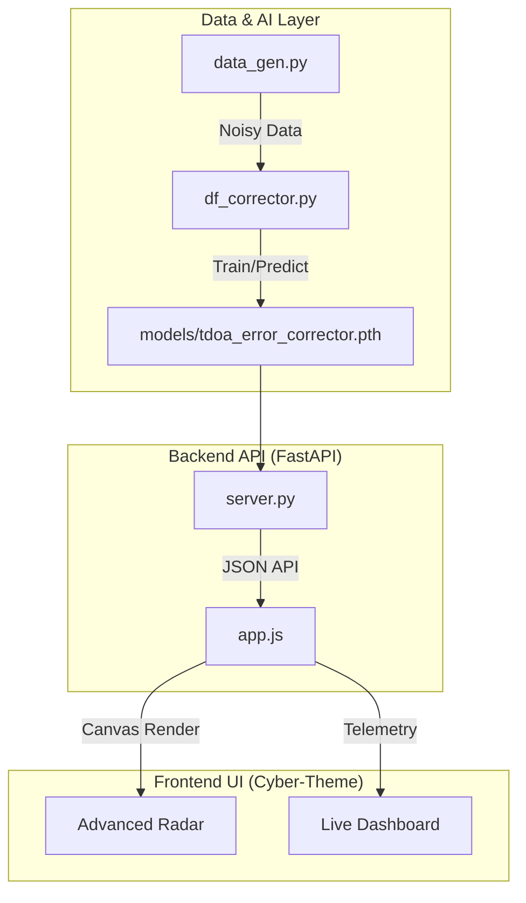

<div align="center">

# 🛰️ AI Direction Finder Corrector
### *TEKNOFEST 2026 | Sinyal Optimizasyonu & Derin Öğrenme*

[](https://github.com/bahattinyunus/ai-direction-finder-corrector)
[](https://img.shields.io/badge/python-3.10%2B-blue.svg)
[](https://fastapi.tiangolo.com/)
[](https://scikit-learn.org/)

**ai-direction-finder-corrector v2.0**, Electronic Warfare (EW) senaryolarında TDOA tabanlı yön bulma algoritmalarının fiziksel kısıtlamalarını (yansıma, gürültü, sapma) derin öğrenme ve FastAPI tabanlı bir mikroservis mimarisi ile aşan kapsamlı bir sistemdir.

---

</div>

## 🧬 Teknik Derin Bakış (Deep Dive)

Bu proje, donanımsal ölçümlerdeki non-linear hataları "kara kutu" olarak modellemek yerine, fiziksel sinyal karakteristiklerini yapay sinir ağları ile normalize eder.

### 1. Gelişmiş Hata Modelleme (`data_gen.py`)
Geleneksel TDOA (Time Difference of Arrival) sistemlerinde varış zamanı farkı hesaplanır:
$$\Delta t = \frac{d \cdot \cos(\theta)}{c}$$

**v2.0 Yenilikleri:**
- **Rayleigh Fading Simülasyonu:** Sinyal genliğindeki dalgalanmaların TDOA jitter'ına etkisi modellendi.
- **Açı-Bağımlı Multipath:** Yansıma hataları artık sadece rastgele değil, sinyal açısına bağlı non-linear bir fonksiyon olarak ekleniyor.
- **Dinamik SNR Jitter:** Düşük SNR seviyelerinde ölçüm belirsizliği (jitter) otomatik olarak artırılır.

### 2. Yapay Sinir Ağı Mimarisi (`df_corrector.py`)
Sistemde kullanılan **Multi-Layer Perceptron (MLP)** şu özelliklere sahiptir:
- **Giriş Katmanı:** [TDOA1, TDOA2, SNR] (3 Feature)
- **Gizli Katmanlar:** 64 ve 32 nöronlu, ReLU aktivasyonlu optimize mimari.
- **Çıkış Katmanı:** [$\sin(\theta)$, $\cos(\theta)$] (Sin-Cos Encoding)

### 3. Premium Dashboard UI (`app.js`, `style.css`)
Tamamen yenilenen arayüz, endüstriyel standartlarda "Cyber-Industrial" temasına sahiptir:
- **Advanced Radar Engine:** Ghost-trail efekti ile geçmiş sinyal izleri ve yoğunluk haritası.
- **Real-time API Integration:** FastAPI backend ile asenkron (async/await) iletişim.
- **Operational Logs:** Tüm retrain ve prediction süreçleri için detaylı terminal çıktıları.
- **Dynamic Calibration:** SNR ve Noise seviyelerine göre anlık hata payı (RMS) kestirimi.

## 🛠️ Yazılım Mimarisi



## 🚀 Hızlı Başlangıç

### 1. Gereksinimleri Yükleyin
```bash
pip install -r requirements.txt
```

### 2. Backend Sunucusunu Başlatın
```bash
python server.py
```

### 3. Frontend'i Açın
`index.html` dosyasını tarayıcıda açın. AI modeli otomatik yüklenecek ve gerçek zamanlı düzeltme başlayacaktır.

### 4. Modeli Yeniden Eğitme
Dashboard üzerinden **"RETRAIN AI"** butonuna basarak modeli güncel parametrelerle eğitebilirsiniz.

---

<p align="center">
  <b>TEKNOFEST 2026 İnsansız Sistemler Grubu</b><br>
  <i>"Hassasiyet Tesadüf Değildir."</i>
</p>