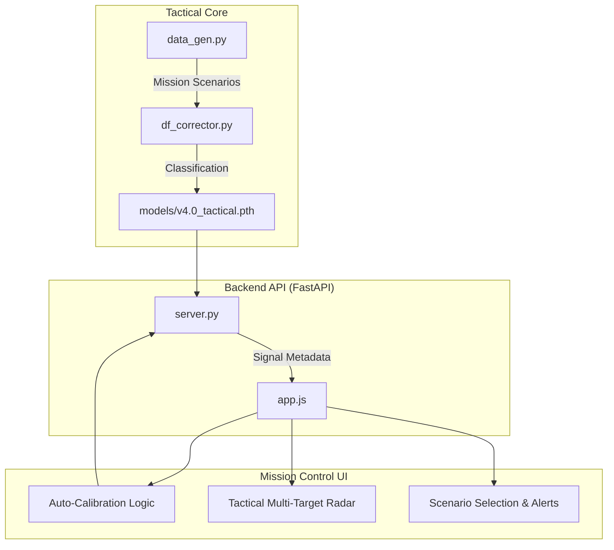

<div align="center">

# 🛰️ AI Direction Finder Corrector
### *TEKNOFEST 2026 | Sinyal Optimizasyonu & Derin Öğrenme*

[](https://github.com/bahattinyunus/ai-direction-finder-corrector)
[](https://img.shields.io/badge/python-3.10%2B-blue.svg)
[](https://fastapi.tiangolo.com/)
[](https://github.com/bahattinyunus/ai-direction-finder-corrector)

**ai-direction-finder-corrector v4.0**, "Tactical Mission Control" sürümü ile sistemi bir harekat kontrol merkezine dönüştürür. Çeşitli harekat ortamları ve otonom kalibrasyon yetenekleri ile en zorlu EW senaryolarına hazırdır.

---

</div>

## 🧬 Teknik Derin Bakış (Deep Dive)

Bu proje, donanımsal ölçümlerdeki non-linear hataları "kara kutu" olarak modellemek yerine, fiziksel sinyal karakteristiklerini yapay sinir ağları ile normalize eder.

### 1. Mission Profiles & Scenarios (`data_gen.py`)
Sistem artık farklı harekat ortamlarını (Environments) simüle edebilir:
- **Desert Storm:** Düşük gürültü, minimum yansıma (Ideal koşullar).
- **Urban Shield:** Çok yüksek multipath (yansıma) ve bina kaynaklı sapmalar.
- **Deep Sea:** Yüksek Rayleigh fading ve değişken gürültü profilleri.

### 2. Autonomous Calibration Engine (`app.js`)
Sistem, tahmin doğruluğunu anlık olarak izler:
- **Auto-Retrain:** AI hata payı (MAE) belirlenen eşiği (8.0°) geçtiğinde, sistem arka planda o anki ortama uygun verilerle kendini otomatik olarak yeniden eğitir.
- **Tactical Alerts:** Sistem durumu, kalibrasyon süreçleri ve kritik hatalar taktik arayüz üzerinden anlık olarak bildirilir.

### 3. Signal Classification (`server.py`)
AI artık sadece yön değil, sinyal karakteristiğini de analiz eder:
- **Heuristic Classification:** SNR, kararlılık ve TDOA paternlerine göre sinyalleri **RADAR**, **JAMMER** veya **COMM** olarak sınıflandırır.

## 🛠️ Yazılım Mimarisi



## 🚀 Hızlı Başlangıç

### 1. Gereksinimleri Yükleyin
```bash
pip install -r requirements.txt
```

### 2. Backend Sunucusunu Başlatın
```bash
python server.py
```

### 3. Frontend'i Açın
`index.html` dosyasını tarayıcıda açın. AI modeli otomatik yüklenecek ve gerçek zamanlı düzeltme başlayacaktır.

### 4. Modeli Yeniden Eğitme
Dashboard üzerinden **"RETRAIN AI"** butonuna basarak modeli güncel parametrelerle eğitebilirsiniz.

---

<p align="center">
  <b>TEKNOFEST 2026 İnsansız Sistemler Grubu</b><br>
  <i>"Hassasiyet Tesadüf Değildir."</i>
</p>