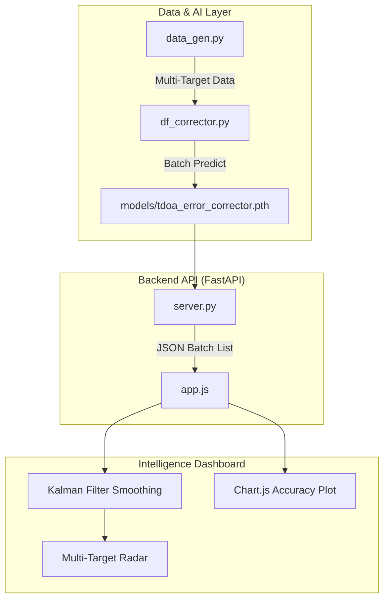

<div align="center">

# 🛰️ AI Direction Finder Corrector
### *TEKNOFEST 2026 | Sinyal Optimizasyonu & Derin Öğrenme*

[](https://github.com/bahattinyunus/ai-direction-finder-corrector)
[](https://img.shields.io/badge/python-3.10%2B-blue.svg)
[](https://fastapi.tiangolo.com/)
[](https://www.chartjs.org/)

**ai-direction-finder-corrector v3.0**, "Intelligence & Analytics" sürümü ile AI tabanlı yön kestirimini profesyonel bir radar analitik platformuna dönüştürür.

---

</div>

## 🧬 Teknik Derin Bakış (Deep Dive)

Bu proje, donanımsal ölçümlerdeki non-linear hataları "kara kutu" olarak modellemek yerine, fiziksel sinyal karakteristiklerini yapay sinir ağları ile normalize eder.

### 1. Multi-Target Signal Simulation (`data_gen.py`)
- **Eşzamanlı Hedef Takibi:** Sistem artık aynı anda birden fazla bağımsız sinyal kaynağını simüle edebilir.
- **Sinyal Girişimi (Interference):** Hedefler arası girişim gürültüsü modele eklenerek gerçek saha koşulları simüle edildi.

### 2. Kalman Filter & AI Fusion (`app.js`)
Sinyal kararlılığını artırmak için hibrit bir yaklaşım kullanıldı:
- **AI Correction:** Sistematik ve non-linear hataların (multipath, fading) temizlenmesi.
- **Kalman Smoothing:** AI tahminlerindeki anlık jitter'ın (titreme) klasik kontrol teorisi ile sönümlenmesi.

### 3. Real-Time Analytics Dashboard (`index.html`, `Chart.js`)
- **Doğruluk Analitiği:** AI'ın ham veriye kıyasla sağladığı iyileşme (MAE) anlık olarak "Performance Analytics" grafiğine yansıtılır.
- **Dinamik Kontroller:** Kalman Filter ve AI Optimizasyonu kullanıcı tarafından anlık olarak toggle edilebilir.

## 🛠️ Yazılım Mimarisi



## 🚀 Hızlı Başlangıç

### 1. Gereksinimleri Yükleyin
```bash
pip install -r requirements.txt
```

### 2. Backend Sunucusunu Başlatın
```bash
python server.py
```

### 3. Frontend'i Açın
`index.html` dosyasını tarayıcıda açın. AI modeli otomatik yüklenecek ve gerçek zamanlı düzeltme başlayacaktır.

### 4. Modeli Yeniden Eğitme
Dashboard üzerinden **"RETRAIN AI"** butonuna basarak modeli güncel parametrelerle eğitebilirsiniz.

---

<p align="center">
  <b>TEKNOFEST 2026 İnsansız Sistemler Grubu</b><br>
  <i>"Hassasiyet Tesadüf Değildir."</i>
</p>