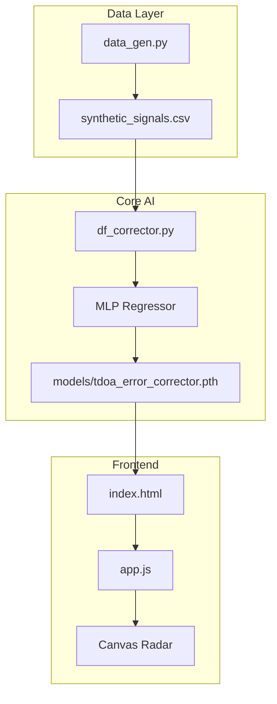

<div align="center">

# 🛰️ AI Direction Finder Corrector
### *TEKNOFEST 2026 | Sinyal Optimizasyonu & Derin Öğrenme*

[](https://github.com/bahattinyunus/ai-direction-finder-corrector)
[](https://img.shields.io/badge/python-3.10%2B-blue.svg)
[](https://pytorch.org/)
[](https://scikit-learn.org/)

**ai-direction-finder-corrector**, Electronic Warfare (EW) senaryolarında TDOA tabanlı yön bulma algoritlamarının fiziksel kısıtlamalarını (yansıma, gürültü, sapma) derin öğrenme ile aşan bir sistemdir.

---

</div>

## 🧬 Teknik Derin Bakış (Deep Dive)

Bu proje, donanımsal ölçümlerdeki non-linear hataları "kara kutu" olarak modellemek yerine, fiziksel sinyal karakteristiklerini yapay sinir ağları ile normalize eder.

### 1. Hata Modelleme ve Veri Simülasyonu (`data_gen.py`)
Geleneksel TDOA (Time Difference of Arrival) sistemlerinde, alıcılar arası mesafe ($d$) ve ışık hızı ($c$) kullanılarak varış zamanı farkı hesaplanır:
$$\Delta t = \frac{d \cdot \cos(\theta)}{c}$$

Ancak gerçek sahada bu denklem şu şekle dönüşür:
$$\Delta t_{noisy} = \Delta t_{true} + \epsilon_{multipath}(\theta) + \epsilon_{gaussian}$$

- **Multipath Fading:** Projedeki simülatör, açıya bağlı sistematik yansıma hatalarını ($5 \cdot \sin(2\theta)$) ekleyerek modelin bu paternleri öğrenmesini sağlar.
- **SNR Weighting:** Sinyal-Gürültü Oranı, verinin güvenilirliğini belirlemek için modele ek girdi (feature) olarak verilir.

### 2. Yapay Sinir Ağı Mimarisi (`df_corrector.py`)
Sistemde kullanılan **Multi-Layer Perceptron (MLP)** şu özelliklere sahiptir:
- **Giriş Katmanı:** [TDOA1, TDOA2, SNR] (3 Nöron)
- **Gizli Katmanlar:** 64 ve 32 nöronlu, ReLU aktivasyon fonksiyonuna sahip derin mimari.
- **Çıkış Katmanı:** [$\sin(\theta)$, $\cos(\theta)$] (2 Nöron)

> [!IMPORTANT]
> **Neden Sin/Cos Encoding?**
> Açı birimleri (0-360) doğrusaldır ancak süreklilik arz etmez (359'dan 0'a geçiş büyük bir "sıçrama" gibi görünür). Bu durum gradyan hesaplamasını bozar. Çıkışı birim çember üzerinde ($\sin, \cos$) tahmin ederek bu "discontinuity" problemini çözüyoruz.

### 3. Gerçek Zamanlı Görselleştirme (`app.js`)
Dashboard, düşük gecikmeli (low-latency) görselleştirme için saf HTML5 Canvas kullanır:
- **Conic Sweep:** 60 FPS frekans tarama simülasyonu.
- **Signal Tracking:** Ham veriden gelen hatalı açı (kırmızı kesikli çizgi) ile AI tarafından düzeltilmiş gerçek açı (yeşil parlak çizgi) anlık olarak kıyaslanır.
- **RMS Error Prediction:** AI modeli, SNR seviyesine göre o anki tahmininin güven aralığını statik modellerin aksine dinamik olarak hesaplar.

## 🛠️ Yazılım Mimarisi



## 🚀 Gelişmiş Kullanım

Eğitilmiş modeli sahada kullanmak:

```python
import torch
import numpy as np
from df_corrector import AIOptimizedDirectionFinder

# 1. Model Başlatma
finder = AIOptimizedDirectionFinder(weights_path="models/tdoa_error_corrector.pth")

# 2. SDR'dan Gelen Ham Veri
# TDOA1: 15.2ns, TDOA2: -4.1ns, SNR: 22dB
raw_data = np.array([[15.2, -4.1, 22.0]])

# 3. Akıllı Düzeltme
prediction = finder.predict_angle(raw_data)

print(f"Hedef Açısı: {prediction['angle']:.2f}°")
print(f"Hata Payı: ±{prediction['rms_error']:.2f}°")
```

---

<p align="center">
  <b>TEKNOFEST 2026 İnsansız Sistemler Grubu</b><br>
  <i>"Hassasiyet Tesadüf Değildir."</i>
</p>